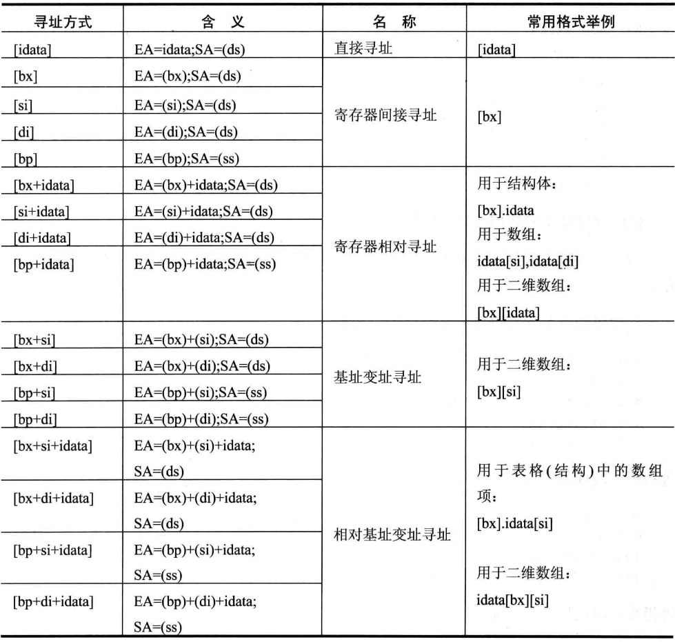

# 资料

- 8086
  - 《汇编语言（第三版）》王爽

# 基础知识

## 概念

- 机器语言：以二进制数字表示的机器指令的集合

- 汇编语言：机器指令便于记忆和书写的形式

  - 汇编指令：机器码的助记符，有对应的机器码
  - 伪指令：无对应的机器码，编译器执行，计算机不执行
  - 其他符号,如+、-、*、/，由编译器识别，无对应的机器码

- 寄存器：CPU中可以存储数据的器件

- CPU：由寄存器，运算器，控制器和内部总线构成

- 汇编编译器：将汇编指令编译为机器码

- 内存：磁盘上的数据读取到内存当中才能被CPU使用

- 指令和数据：应用上的划分，在存储上没有区别，同样一段内容可以被解释为指令，也可以解释为数据

- 存储单元：一个存储单元可以存储一个byte

  - bit：比特，1个二进制位
  - nibble：半字节，4个bit
  - byte：字节，8个bit
  - word：字，2个byte，分别称为这个字的高位字节和低位字节

- 字单元：存放一个字型数据的内存单元（16位由两个连续的存储单元组成）

- 外部总线：连接CPU和其他器件的导线

- 主板：排设主要器件——CPU，存储器，外围芯片组，扩展插槽

- 扩展插槽：插有RAM内存，和各类接口卡

- 接口卡：CPU控制外部设备的媒介

- 存储器：

  - 随机存储器RAM：可读写，但必须带电存储，关机后内容丢失

  - 只读存储器ROM：只读，关机后内容不丢失

    按功能划分：

    - 随机存储器：装在主板和扩展插槽上的RAM
    - 装有BIOS（Basic Input/Output System）的ROM：位于主板和各类接口卡上
    - 接口卡上的RAM：对大批量的输入输出进行暂时存储，如显存

- 内存地址空间：CPU可以寻址的内存

- 物理地址：内存单元在地址空间中具有的唯一的地址

- 进制：

  - 二进制，计算机用0,1记录数据，贴近机器语言，表示时在末尾加B
  - 八进制，3个二进制位，Linux权限表示时的1,2,4其实可分别视作001,010,100（乱入）
  - 十进制，人类计数习惯，因为有十根手指头
  - 十六进制，半字节刚好可表示一位十六进制数，便于直观表示数据，在末尾加H

- 十六位CPU：

  - 运算器一次性处理十六位
  - 寄存器最多存储十六位
  - 运算器和寄存器之间通路为十六位
  - 受此限制，8086CPU中一个代码段的最大长度不超过64KB

- 端口：

  - 从芯片说起，CPU通过总线连接：
    1. 各种接口卡（如网卡，显卡）
    2. 主板上的接口芯片，用于访问外设
    3. 其他芯片，存储相关的系统信息或处理相关的输入输出
  - 这些芯片中都有一组可读写的寄存器：
    1. 与CPU总线相连
    2. CPU对其进行读写时，都通过控制线向其所在的芯片发出端口读写命令
  - CPU将这些寄存器当做端口，统一编址
  - CPU最多定位64KB个不同的端口，读写命令只有两条：in/out，通过这两条命令在CPU寄存器与端口间进行数据传输

- CMOS RAM芯片

  - 包含一个实时时钟和一个128存储单元的RAM
  - 靠电池供电，关机后内部实时钟仍可以正常工作
  - 内部时钟占用一部分单元保存时间信息，大部分单元用于保存系统配置信息，启动时由BIOS读取
  - CPU通过两个端口读写，一个存放地址，一个存放数据

- BCD码：以4位二进制数表示十进制数码的编码方法

## 原理

- 进行三类信息的交互：

  1. 地址信息
  2. 控制信息
  3. 数据信息

  分别对应不同的总线（根据功能划分）

  - 寻址能力：

    由地址总线的宽度（能传输多少位数据）决定，设为n，则能访问2^n个内存单元

  - 数据传送能力

    由数据总线的宽度决定，同样的数据量，宽度较窄的传递的次数更多，耗时长

  - 控制能力

    由控制总线的数量决定，每根控制总线控制一种操作，多少根总线就有多少种控制

- 将各类存储期间视作一个逻辑存储器（内存地址空间）

  内存地址空间大小由地址总线的宽度限制

  8086 PC机中

  - 00000——9FFFF为主存储器地址空间
  - A0000——BFFFF为显存地址空间
  - C0000——FFFFF为各类ROM地址空间

- CPU中地址的形成

  8086CPU由20位地址总线，1MB的寻址能力，而又是16位结构，通过在内部用两个16位地址合成的方法来生成一个20位的地址。

  两个十六位地址分别称为段地址和偏移地址，在地址加法器中合成为一个20位的物理地址。

  物理地址=段地址×16（左移4个二进制位）+偏移地址

  即：基础地址+偏移地址=物理地址

  8086PC机中一般用“段地址：偏移地址”的格式表示物理地址

- 内存中字的存储

  16位寄存器存储一个字，内存单元是字节单元，一个单元存放一个字节，则用两个连续的内存单元来存储一个字，低位字节在低地址，高位字节在高地址

- 键盘输入在屏幕上的显示，按照ASCII编码，输入的字符被转化为相应的数据存入内存中，由文本编辑软件写入显存的相应位置，再由显卡按照ASCII编码表示为相应的字符

- 数据在显存当中的位置决定了数据在屏幕上显示的位置，每一个字符占据两个字节，高位字节存放字符属性，低位字节存放ASCII码

# 汇编基础

## 寄存器

程序员通过改变寄存器中的内容实现对CPU的控制（几乎所有操作都与寄存器有关）

8086 CPU有14个寄存器，均为16位

- AX（Accumulator 累加寄存器），BX（Base 基址寄存器），CX（Count 计数寄存器），DX（Data 数据寄存器）

  统称数据寄存器，存放一般性数据

  均可以分为两个独立的8位寄存器使用（XH和XL，X∈{A,B,C,D}）

  一个内存单元只有8位，若要将一个内存单元处的值赋给一个通用寄存器，应当将用其低位寄存器接收数据，并将其高位置为0

- CS（代码段寄存器Code Segment），IP（指令指针寄存器Instruction Pointer）

  任意时刻，计算机将CS：IP指向的内容当做执行指令

  DS（数据段寄存器Data Segment）

  语句中读取某一内存地址处的数据，只给出偏移地址这一个参数，以DS的值为段地址

  SS（栈段寄存器Stack Segment），SP（栈指针Stack Pointer），BP（基址指针寄存器Base Pointer）

  SS：SP指向栈顶，SS为段地址，SP为偏移地址，BP可以用作SS的一个相对基址位置

  ES：（附加段寄存器 Extras Segment）

  循环中若需用两段不同的内存地址，则可以利用该寄存器避免反复修改DS

  CS，DS，SS，ES统称段寄存器

  SP，BP统称指针寄存器

- SI（源变址寄存器Source Index），DI（目的编制寄存器Destination Index）

  SI可用于存放相对于DS段的源变址指针，DI可用于存放相对于ES段的目的变址指针

  SI，DI又称变址寄存器

  在进行复制时，可用SI指向源地址，DI指向目的地址

- FLAG（标志寄存器）

  FLAG按位起作用，在8086PC机中只有0，2，4，6，7，8，9，10，11有特殊含义

  分别为CF,PF,AF,ZF,SF,TF,IF,BF,OF

  FLAG与IP统称控制寄存器

### FLAG

- ZF （zero），零标志位，指示执行计算指令后的结果是否为0，是则为1，不是则为0
- PF（parity），奇偶标志位，若计算结果中为1的位数为偶数则为1，为奇数则为0
- SF（sign），符号标志位，若计算结果为负数（按补码的标准判断）则为1，非负数则为0
- CF（carry），进位标志位，记录了无符号运算数最高有效位向更高位的进位值或借位值（inc，loop不影响CF）
- OF（overflow），溢出标志位，若有符号运算发生溢出，则为1，否则为0
- DF（direction），方向标志位，若为0，每次操作后si，di递增，若为1，每次操作后si，di递减
- TF（trace）跟踪标志位，为0则程序持续运行，为1则下一步单步执行
- IF（interrupt）中断允许标志位

## 约定

- R：通用寄存器（Register）

- I：数据（Integer）

- P：地址（Position）

- [N]：寻址，有多种形式

  注意这些不同的寻址形式对应着不同的段地址

  

  [bx].idata[si]的表示方式类似于C语言中的struct，可自行领会

- N地址字单元：起始地址为N的字单元

- reg（通用寄存器）sreg（段寄存器）

## 语法

### 计算指令

- add		R/[]	R/I/[]	前者的值加上后者
- sub		R/[]	R/I/[]	前者的值减去后者

add和sub不能操作段寄存器

- inc 将原数据+1
- dec 将原数据-1
- and	R 	I 	按位与
- or   	R 	I         按位或
- div          R/[]      除法指令

参数为除数，默认为8位或16位

被除数默认为AX或AX和DX，若除数为8位，则被除数存放于AX；若除数为16位，则被除数高16位位于DX，低16位位于AX

若除数为8位，则AL存商，AH存余数；若除数为16位，则AX存商，DX存余数

- mul    R/[]      乘法指令

要求两个乘数的位数相同，若为8位，则另一个乘数默认为AL，结果存放于AX；若为16位，则另一个乘数默认为AX结果高位位于DX，低位位于AX

注意：

若超出范围则“舍弃”高位（保存在CF中），且通用寄存器视为两个不同寄存器，故不能认XL超出的部分加在XH上

操作的两个对象的位数必须相同

- adc    

书写同add，而运算后在结果上再加上CF的值，可用于任意位数的加法的计算

- sbb

书写同sub，而运算后在结果上再减去CF的值，可用于任意位数的减法的计算

### 逻辑指令

- cmp

相当于sub，但是结果并不保存，只影响FLAG的值，依据各FLAG的值判断大小关系，无符号数考察zf，cf；有符号数考察zf，sf，of的值，此处应当考察是否存在溢出的情况，逻辑结果与真实结果不一定相同

- shl/shr

逻辑位移指令，接两个参数，位移的对象和位移的位数，位数大于1时必须将移动位数存放在cl中

shl：

1. 将第一个寄存器或内存单元中的数据向左位移
2. 最后溢出的一位写入CF中
3. 最低位补0

shr逻辑右移，与shl相反

利用逻辑位移指令可以取一个内存单元中的指定位

### 处理机控制指令

- cld，std分别将DF的值设置为0和1
- cli，sti分别将的值IF设置为0和1

### 传送指令

mov无法修改代码段寄存器和指令指针寄存器的值

mov无法直接将数值赋给段寄存器（可通过读取内存或者利用另一寄存器中转）

读写内存时，读写的位数由另一个参数的位数决定

- mov	R/[]		R/I/[]	将后者的值送入前者

- push 	R /[]	压栈（抬升栈指针，将参数的值放入栈顶）
- pop		R/[]	出栈（取出栈顶数据放入参数中，降低栈指针）

（R可以为段寄存器）

栈的最大范围与SP存储的数据范围有关，超过界限会发生栈顶环绕

- pushf，popf，将标志寄存器的值压栈和出栈

### 转移指令

- jmp 	段地址：偏移地址 	CS=段地址，IP=偏移地址

同时修改CS：IP，称为段间转移

- jmp 	R	将存储在指定寄存器中的值传递给IP

只修改IP，称为段内转移

jmp short xxx

短转移（-128~127）,IP = IP +8位偏移量（标号的位置-jmp的下一步操作的位置，由编译器计算得出，负数用补码表示）

jmp near xxx

近转移（-32178~32767）IP=IP+16位偏移量，同上

以上两种机器码中只有相对偏移量，没有目的地址

jmp far prt xxx

远转移，或称段间转移，机器码中有目的位置的段地址和偏移地址

从内存中读取转移地址：

jmp word ptr []

段内转移，从该位置取一个字节，作为偏移地址

jmp dword ptr []

段间转移，从该位置取两个字节，高地址处为段地址，低地址处为偏移地址

- loop 	xxx       cx-1，若不为0，跳转至该标号处继续执行

短转移，循环时可用bx当做计数器，连续的读取一段内存，可调整段地址的值从而使该寄存器中的数始终为一位。（可用多种不同的方式表示同一个地址）

- jcxz    xxx     

有条件转移（jump cx zero）若cx=0，则跳转到标号为止，有条件转移都是短转移

按位移表示的转移有利于程序的浮动装配

- ret

  近转移，相当于pop    IP

- retf

  远转移，相当于pop   IP  ；pop    CS

- call     

  1. 将当前的CS，IP压入栈中
  2. 转移

  - call    xxx
  - call 16位reg
  - call  word  ptr  []

  相当于压栈后执行近转移

  - call far ptr  xxx
  - call  dword  ptr  []  （低8位为IP，高8位为CS）

  相当于压栈后执行段间转移

一些转移指令将检测FLAG的值，常与cmp联用

- je jne（equal）判断是否相等则（检测ZF的值）
- jb jnb（below）判断是否小于（检测CF的值）
- ja jna（above）判断是否大于（检测CF和ZF的值）

以上六条指令都针对的是无符号数

### 串处理指令

- movsb（string byte）,movsw（string word）

串传送操作，步长分别为1，2，用于串传送，方向由DF确定，常和rep（repeat）搭配使用，格式为rep movsx，次数由cx决定

传送的原始位置DS：SI，目标位置ES：DI，方向DF，次数CX

## 原理

- 指令的执行

  - CPU从CS：IP读取指令放入指令缓冲器
  - IP+=读取的指令长度
  - 执行指令，跳回到第一步

  计算机刚启动时CS=FFFFH，IP=0000H

- 内存的读取

  在读取内容的时候DS的值为段地址，[]中为偏移地址

- 栈

  LIFO（last in first out）

  push，抬升栈顶，压入数据

  pop，取出数据，降低栈顶

  （从高地址向低地址生长）

  可能存在栈顶超界问题

- 数据的读写必须解决两个问题

  1. 数据存放的位置

     机器指令执行前，数据可以在三个地方：CPU内部，内存，端口

  - 立即数（idata）包含于汇编指令当中，执行前位于CPU的指令缓冲器内
  - 寄存器
  - 段地址SA和偏移地址EA

  2. 内存单元的长度

  - 没有寄存器参与的内存访问指令中，用word ptr或byte ptr声明内存单元
  - 有寄存器参与的以寄存器宽度为准
  - push，pop默认为字操作（word）

# 汇编程序

## 程序

- 伪指令

  - xxx segment

    xxx ends（end segment）

  标识一个段的开始和结束

  - xxx

  标号，作为一段代码或某一个位置的标记，写程序时，xxx相当于一个数值，标记这个位置的段地址

  此外，包含单元长度的标号称为数据标号，标记了存储数据的单元的地址和长度

  - end xxx

  标识程序结束，同时xxx将被识别为程序的入口，运行时程序将从此处开始运行（CS：IP指向的位置）

  - assume R（段寄存器）：XXX

  将特定的寄存器和代码段关联（但仍需在程序中手动设置相应的段寄存器的值）

  即，当我们用标号表示某一个偏移地址时，编译器自动选取相应的段寄存器中的值作为段地址

  - 返回

  mov ax 4c00H

  int 21H

  - loop xxx

    将CX的值-1，若CX=0，则执行下一条指令，若CX！=0，则跳转回标号为xxx处执行程序

  - 汇编源程序中，以字母开头的数据应当在前面加0

  - 汇编源程序中，要访问某一内存地址，应当用寄存器表示偏移地址，或者在前方显式的给出段寄存器的值（i.e Debug中写作[idata]即可读取偏移地址为idata处的数据，而源程序中应当写作ds:[idata]）

    出现在访问内存单元的在指令中，用于确定段地址的寄存器称为段前缀

  - dw（define word）定义字，将其放入段中，也可以通过dw来开辟一段内存空间用作栈

    相应的，还有db（define byte），在输入字母数据（用ASCII码表示，8个bit）时将使用，

    db（define double word）定义双字型数据（dword）

  - dx	重复次数	dup	（重复的字节型数据）

    其中dx为dw,db,dd,用此方式重复用数据填充内存

  - ' '声明数据以字符的形式给出，内容将会被转换为相应的ASCII码
  - offset xxx将会被解释为xxx的偏移地址

## 原理

- 流程：编辑——编译——连接——加载——运行

  ​	    edit       masm      link    command  CPU

- 程序需要由一个正在运行的程序载入内存，最终再返回该程序，这个程序就是shell

- 加载程序至一块空间足够的内存
  - 256字节的程序前缀用于与被加载程序通信
  - 紧接着为程序区

- 内存中0:200-0:2ff段一般没有存储重要数据，可用于实验中向内存中写入数据

- 编译，连接时对源程序代码进行处理，得到描述信息，其中说明了程序的入口地址

- 大小写字母的ASCII码的区别仅仅在于其第五位（二进制）大写为0，小写为1，可以通过位运算在不通过判断的情况下，直接实现大小写统一

- 多重循环，由于只由一个counter，需要将利用栈来存放进出时每一重循环的值

- 上一条延伸至子程序的调用即，调用子程序前将子程序用到的寄存器全部入栈，子程序运行结束后，寄存器出栈

# 汇编进阶

## 中断

CPU在执行完当前操作后接收到某种信息，在执行下一个步骤之前立即对其进行处理，中断信息为一个字节的数据，可以表示256种不同的中断源，CPU依据接收到的八位中断码，在存储于内存前1024个单元中的中断向量（中断处理程序入口地址）表中找到相应的中断向量（0200至02FF部分的内存一般是空的），依次设置CS和IP（原值保存于栈中），这个过程为中断过程，由CPU硬件自动实现。

- 取得中断类型码N
- pushf
- TF=0，IF=0
- push CS
- push IP
- IP=N×4，CS=N×4+2

中断处理子程序：

-  保存用到的寄存器
- 处理中断
- 恢复寄存器
- 用iret指令返回（与中断过程相对应）

安装中断处理程序时，先将中断处理程序载入内存中某一空闲段，然后相应的设置中断向量表

响应中断的特殊情况：

​	执行完向段寄存器传送数据的指令后，即使发生中断，CPU也不会响应，因为处理中断过程要压栈，而ss改变，sp未改变的状态下ss:sp指向的时错误的栈顶，将引起错误，应当利用这一特征连续的修改ss和sp的值

BIOS和DOS提供的中断例程：

​	系统板的ROM中存放这BIOS，主要包含

1. 硬件系统的检测和初始化程序

2. 外部中断和内部中断的中断例程

3. 用于对硬件设备I/O的中断例程

4. 其他和硬件系统相关的中断例程

   DOS中也提供了中断例程，DOS中段例程就是操作系统向程序员提供的编程资源

   - 安装过程：
     - 开机后，CPU自动从FFFF：0开始执行，此处的跳转指令使CPU转去执行BIOS的硬件系统检测和初始化程序
     - 初始化过程中建立BIOS的中断向量，将其提供的例程入口登记在向量表中（程序一直都在ROM中）
     - 调用int 19h进行操作系统的应到，从此将计算机交由操作系统控制
     - DOS启动后，还将其提供的中断例程装入内存，并建立相应的中断向量
   - 调用这些中断例程的过程中，利用寄存器中的值传递参数，其中用ah传递内部例程的子程序的编号（感受函数返回时mov   ax，4cooh；int   21h的含义）

### 内中断

CPU内部产生的中断信息，可能来源和对应的中断码为：

- 除法错误：0
- 单步执行:1
- 执行into指令:4
- 执行int指令:格式为int n，n即其中断码

int指令，与call相似，调用中断码为n的中断处理程序（中断例程）

### 外中断

CPU通过接口芯片的端口和外部设备进行联系

外中断的来源分为两类：

1. 可屏蔽中断（CPU是否响应取决于IF，IF=1则响应外中断，否则不响应，几乎所有由外设引起的中断都是可屏蔽中断）
2. 不可屏蔽中断（计算机中有必须处理的紧急事件发生时通知计算机的中断信息）

例：

​	PC机键盘输入读取

​	每个按键相当于一个开关，由键盘中的芯片对开关的状态进行扫描，开关接通时，芯片中产生相应的扫描码说明按键在键盘上的位置，称为通码，松开时也产生相应的扫描码，称为断码，通码与断码区别在于前者第七位为0，后者第七位为1。扫描码存放在该芯片的一个端口中，键盘的输入到达端口后，芯片将向CPU发出中断信息，若CPU响应中断则执行int 9例程：1. 读取扫描码；2. 对于字符信息，转换为相应的ASCII码存放于BIOS的键盘缓冲区（高位存放扫描码，低位存放字符码），切换和控制信息则存放与内存中存储状态字节的单元； 3. 对键盘系统进行相应的控制

## 直接定址表

数据之间存在对应关系，将目标数据列表，将原始数据作为偏移量进行转换。依据数据可以直接定位出所要查找的元素的位置的表称为直接定址表

好处：精简代码，加快速度，代码易于扩充

---

针对性的阅读了对我有帮助的部分，并不完全，若有错误，愿大家不吝赐教

